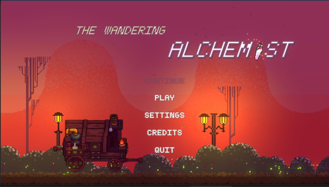
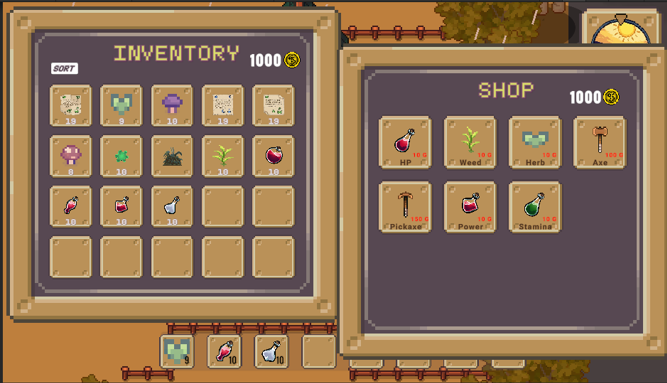
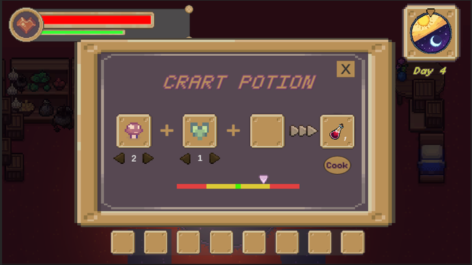
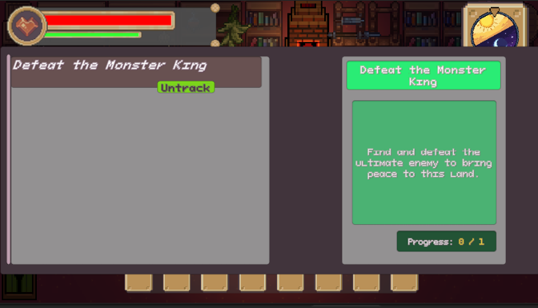
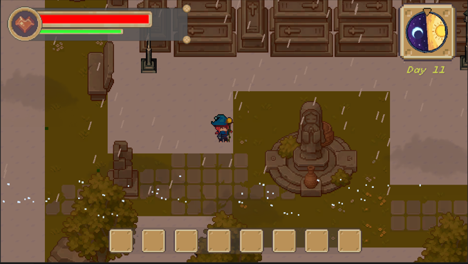
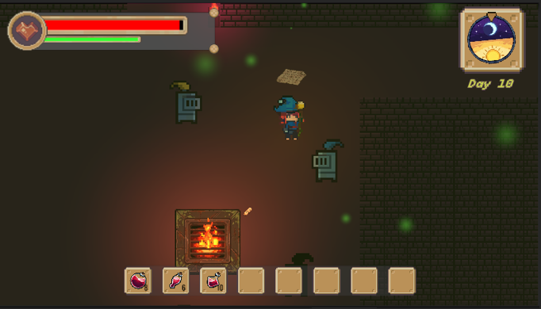

# ✦ WANDERING ALCHEMY ✦

### *A 2D Top-Down RPG — Solo Developed with Unity & C#*

 

---

## ✦ Overview

**Wandering Alchemy** is a handcrafted fantasy RPG where players explore vibrant regions, battle creatures, craft potions, complete quests, and uncover the secrets of a living, breathing world.

> 🛠 **Built entirely solo** — from systems design to pixel polish, every element reflects deliberate craftsmanship and technical depth.

---

## ✦ Key Features

| ⚔️ Combat | 🗣️ Quest & Dialogue | 🎒 Inventory |
|-----------|---------------------|--------------|
| Projectile-based attacks | Branching NPC conversations | Drag-and-drop system |
| Critical hit mechanics | Quest progression tracking | Stackable items |
| Hit-stop & camera shake | Dynamic dialogue choices | Consumables & materials |

| 🌦 World Systems | 💾 Save & Load | 🧪 Alchemy |
|------------------|----------------|------------|
| Day & Night cycle | JSON serialization | Recipe-based crafting |
| Dynamic weather | Persistent player data | Unlockable combinations |
| Seamless scene transitions | Cross-scene state management | Material gathering |

---

## ✦ Tech Stack

| **Engine** | **Language** | **Rendering** | **UI** | **Camera** | **Data** | **Architecture** |
|------------|--------------|---------------|--------|------------|----------|------------------|
| Unity 2022 | C# | URP | Unity UI + TMP | Cinemachine | JSON | Event-Driven + OOP |

---

## ✦ Visual Showcase

| Menu | Inventory & Shop |
|:----:|:----------------:|
|  |  |

| Alchemy System | Quest Log |
|:--------------:|:---------:|
|  |  |

| Dynamic Weather |
|:---------------:|
|  |

---

## ✦ Gameplay

  
    
  <em>⚡ Explore. Fight. Craft. Survive. ⚡</em>

---

## ✦ What I Built

| Area | Details |
|------|---------|
| 🎮 **Gameplay Programming** | Movement, combat, AI, player mechanics |
| 🧩 **System Architecture** | Event-driven design, scalable codebase |
| 🎨 **UI/UX Development** | Intuitive interfaces for all systems |
| 🌍 **World Systems** | Weather, day/night, transitions |
| 💾 **Data Management** | JSON save/load with cross-scene persistence |
| 🔧 **QA & Polish** | Full testing, optimization, bug fixing |

---

## ✦ Play Now

### [🎮 The Wandering Alchemist on Itch.io](https://thaiabcc.itch.io/the-wandering-alchemist)

---

## ✦ About the Developer

I'm a **game programmer** passionate about crafting immersive experiences and building robust, maintainable systems. This project showcases my ability to:

- 🧠 **Own features end-to-end** — from concept to polish
- 🏗️ **Design scalable architectures** — clean, modular, event-driven
- 🎯 **Deliver polished products** — player-first experiences that feel complete

📬 **Open to opportunities in game programming, systems design, and interactive development.**

---

---

### ✦ *"From concept to completion — built with passion, precision, and purpose."* ✦

